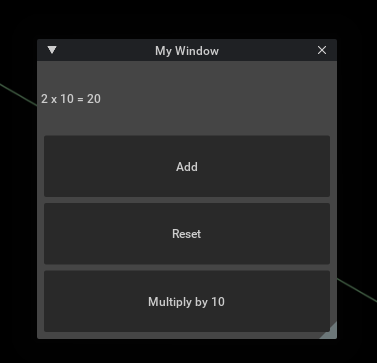
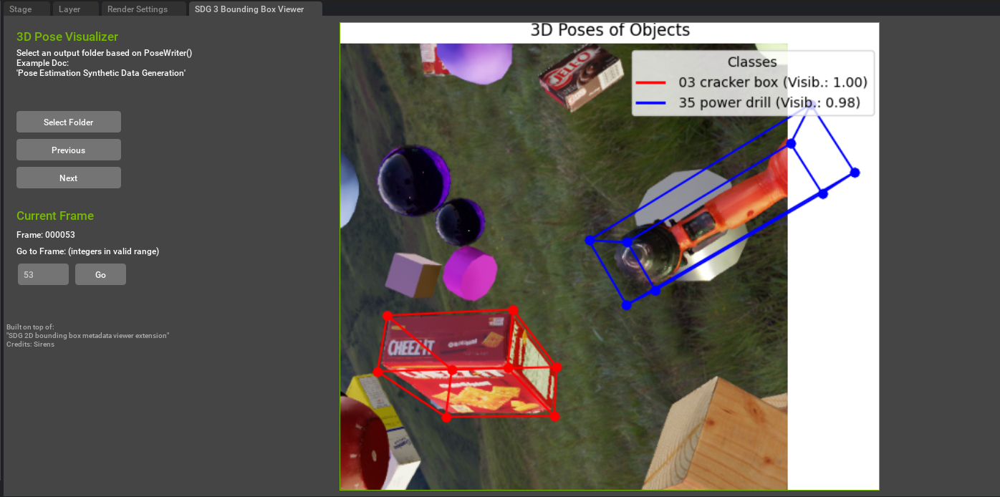
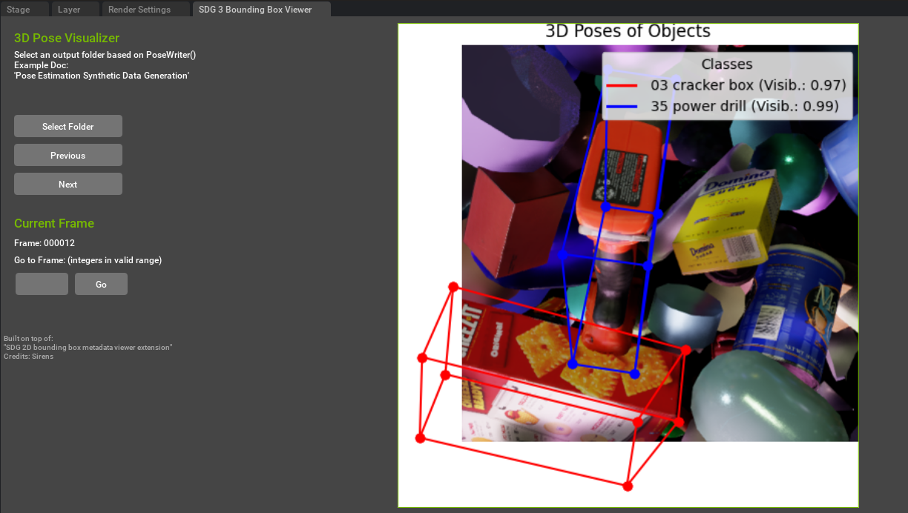

# Omniverse_Extensions

### This Repo is for my future custom Omniverse Extensions

### 1. Extension sim_ext
A beginner-friendly guide for extensions from Scott Dempsey (Sirens) for the Omniverse Isaac Lab Study Session (Omniverse Discord Server)

### 2. Extension: Pose_Vis - SDG 3 Bounding Box Viewer
The 3D Pose Visualizer extension built on top of the "SDG 2D bounding box metadata viewer extension. (Credits: Scott Dempsey (Sirens))" This tool allows users to visualize 3D poses of objects using bounding boxes projected onto images. The extension dynamically displays objects' metadata, such as class and visibility, and includes an interactive UI for navigating through frames.

