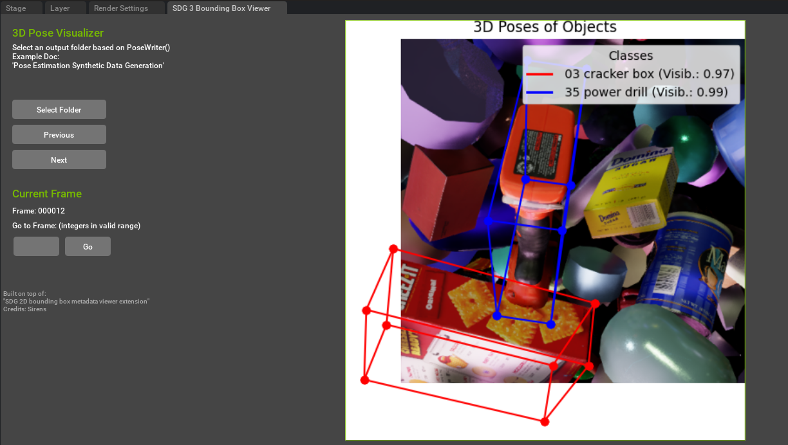

# Omniverse_Extensions

### This Repo is for my future custom Omniverse Extensions

---

## 1. Extension: sim_ext
A beginner-friendly guide for extensions from Scott Dempsey (Sirens) for the Omniverse Isaac Lab Study Session (Omniverse Discord Server)

---

## 2. Extension: Pose_Vis - SDG 3 Bounding Box Viewer
The 3D Pose Visualizer extension built on top of the "SDG 2D bounding box metadata viewer extension. (Credits: Scott Dempsey (Sirens))" 

This tool allows users to:
- Visualize 3D poses of objects using bounding boxes projected onto images.
- Dynamically display objects' metadata, such as class and visibility.
- Interact with an intuitive UI for navigating through frames.

### Visual Previews:

  
  

